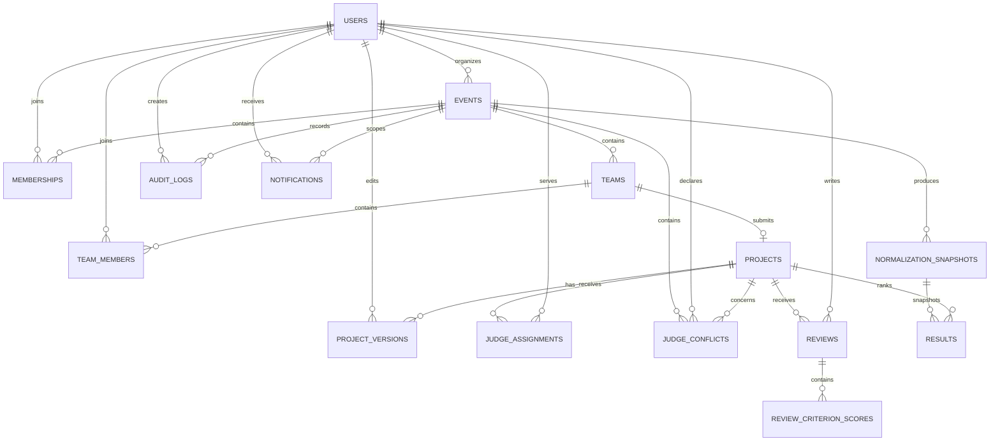

# AGAMOTTO Data Model

## 1. Overview

AGAMOTTO stores the event lifecycle and judging state in PostgreSQL through SQLAlchemy models and Alembic migrations.

The core data path is:

```text
User
  │
  ├── Event Membership
  │       │
  │       └── Team
  │              │
  │              └── Project
  │                      │
  │                      ├── Judge Assignment
  │                      ├── Review
  │                      │     └── Criterion Scores
  │                      └── Result
  │                             └── Normalization Snapshot
  │
  └── Audit / Notification
```

## 2. ER diagram



## 3. users

**Purpose:** authentication, identity, and role information.

Key fields:

- `id`
- `email`
- `name`
- `password_hash`
- `role`
- organizer profile fields
- judge affiliation/title/specialization fields
- participant college/degree/graduation/GitHub fields

Relationships:

- organizer → events
- user → event memberships
- user → team memberships
- user → assignments
- user → conflicts
- user → reviews
- user → audit logs
- user → notifications

Roles are:

```text
ORGANIZER
JUDGE
PARTICIPANT
```

## 4. events

**Purpose:** event configuration and lifecycle.

Key fields include:

- `id`
- `organizer_id`
- `title`
- `tagline`
- `description`
- `event_code`
- `access_code`
- `status`
- `is_public`
- `registration_mode`
- `editing_policy`
- `versioning_enabled`
- `min_team_size`
- `max_team_size`
- `participant_capacity`
- `judges_per_project`
- registration/submission/judging deadlines
- `tracks`
- `prizes`
- `rubric`
- `normalization_method`
- `tie_break_order`
- `created_at`

The event stores rubric configuration as JSON in the current implementation.

Event status transitions are enforced by the backend:

```text
DRAFT → REGISTRATION → SUBMISSION → JUDGING → CLOSED
                                      ↓
                                   RESULTS
                                      ↓
                                  ARCHIVED
```

The supplied implementation permits:

```text
DRAFT → REGISTRATION or CLOSED
REGISTRATION → SUBMISSION or CLOSED
SUBMISSION → JUDGING or CLOSED
JUDGING → CLOSED
RESULTS → ARCHIVED
```

Result publication moves the event to `RESULTS`.

## 5. memberships

**Purpose:** associates users with an event and stores participant approval state.

Key fields:

- `id`
- `event_id`
- `user_id`
- `status`
- `created_at`

Critical constraint:

```text
UNIQUE(event_id, user_id)
```

This prevents duplicate event membership.

## 6. teams

**Purpose:** groups participants within an event.

Key fields:

- `id`
- `event_id`
- `name`
- `invite_code`
- `track`
- `created_at`

A team belongs to one event.

## 7. team_members

**Purpose:** many-to-many relationship between users and teams.

Key fields:

- `id`
- `team_id`
- `user_id`
- `is_leader`
- `role`

Critical constraint:

```text
UNIQUE(team_id, user_id)
```

The API additionally enforces one team per participant per event and maximum team size.

## 8. projects

**Purpose:** the team's hackathon submission.

Key fields:

- `id`
- `event_id`
- `team_id`
- `code_name`
- `title`
- `tagline`
- `problem`
- `solution`
- `tech_stack`
- `github_url`
- `demo_url`
- `presentation_file_name`
- `track`
- `status`
- `submitted_at`
- `version`

Critical constraints:

```text
UNIQUE(team_id)
UNIQUE(code_name)
```

Therefore a team can submit one project.

Project state is represented as:

```text
DRAFT
SUBMITTED
LOCKED
```

The API controls editing using event phase and editing policy.

## 9. project_versions

**Purpose:** optional immutable-ish historical snapshots of meaningful project edits when event versioning is enabled.

Key fields:

- `id`
- `project_id`
- `version`
- `timestamp`
- `summary`
- `edited_by`
- `snapshot` JSON

Critical constraint:

```text
UNIQUE(project_id, version)
```

## 10. judge_assignments

**Purpose:** maps judges to projects.

Key fields:

- `id`
- `project_id`
- `judge_id`
- `status`
- `created_at`

Critical constraint:

```text
UNIQUE(project_id, judge_id)
```

The event determines how many judges are required per project.

## 11. judge_conflicts

**Purpose:** stores blocking judge/project conflicts.

Key fields:

- `id`
- `event_id`
- `judge_id`
- `project_id`
- `reason`
- `blocking`
- `created_at`

The current blocking rules include:

- judge is a project team member
- judge participated in the event
- judge-declared conflict
- organizer-recorded conflict

## 12. reviews

**Purpose:** stores one judge's evaluation of one project.

Key fields:

- `id`
- `project_id`
- `judge_id`
- `status`
- `justification`
- `total_raw`
- `created_at`
- `updated_at`

Critical constraint:

```text
UNIQUE(project_id, judge_id)
```

Review state machine:

```text
DRAFT → FINALIZED → LOCKED
```

Organizer reopen:

```text
FINALIZED/LOCKED → DRAFT
```

The reopen action is audited.

## 13. review_criterion_scores

**Purpose:** stores individual rubric criterion scores.

Key fields:

- `id`
- `review_id`
- `criterion_id`
- `score`
- `justification`

Critical constraint:

```text
UNIQUE(review_id, criterion_id)
```

The rubric criterion definition currently lives inside the event's `rubric` JSON configuration. The score table references the criterion by its configured ID.

## 14. normalization_snapshots

**Purpose:** immutable calculation snapshots for a result calculation.

Key fields:

- `id`
- `event_id`
- `method`
- `statistics` JSON
- `results` JSON
- `created_at`

For Z-score normalization, `statistics` stores per-judge:

- mean
- standard deviation
- review count

The snapshot also stores result rows used for ranking.

This allows a published result to reference the calculation snapshot that produced it.

## 15. results

**Purpose:** ranked project output associated with a normalization snapshot.

Key fields:

- `id`
- `event_id`
- `project_id`
- `raw_score`
- `normalized_score`
- `final_score`
- `rank`
- `snapshot_id`
- `published`
- `created_at`

Critical constraint:

```text
UNIQUE(snapshot_id, project_id)
```

Publication changes the `published` state of result rows associated with the selected snapshot.

## 16. audit_logs

**Purpose:** record important workflow mutations.

Key fields:

- `id`
- `actor_id`
- `event_id`
- `action`
- `entity_type`
- `entity_id`
- `details` JSON
- `created_at`

Examples:

```text
EVENT_CREATED
PARTICIPANT_REGISTERED
MEMBERSHIP_APPROVED
TEAM_CREATED
PROJECT_CREATED
PROJECT_UPDATED
JUDGE_ASSIGNED
JUDGE_ASSIGNMENT_BLOCKED
CONFLICT_DECLARED
REVIEW_CREATED
REVIEW_FINALIZED
REVIEW_LOCKED
REVIEW_REOPENED_BY_ORGANIZER
RESULTS_CALCULATED
RESULTS_PUBLISHED
EVENT_ARCHIVED
```

The audit model is an application log. It is not a blockchain or cryptographic hash-chain.

## 17. notifications

**Purpose:** local in-application notifications.

Key fields:

- `id`
- `user_id`
- `event_id`
- `message`
- `read`
- `created_at`

The organizer reminder endpoint creates notification rows for approved participants and assigned judges.

## 18. Rubric data

The current schema stores rubric criteria inside `events.rubric` JSON.

Each criterion contains:

```json
{
  "id": "innovation",
  "name": "Innovation",
  "description": "Originality and value",
  "weight": 60,
  "maxScore": 10,
  "anchors": []
}
```

Validation rules:

- at least one criterion
- unique criterion IDs
- positive weights
- positive max scores
- total weight exactly 100

Criterion score values are validated against `maxScore`.

## 19. Critical constraints

The most important relational constraints are:

| Rule | Enforcement |
|---|---|
| One membership per event/user | DB unique constraint |
| One team membership per team/user | DB unique constraint + API |
| One team per participant/event | API |
| One project per team | DB unique constraint |
| Unique project code | DB unique constraint |
| One judge/project assignment | DB unique constraint + API |
| One review/judge/project | DB unique constraint + API |
| One score/review/criterion | DB unique constraint |
| Score range | API validation |
| Required final criteria | API validation |
| Required final justifications | API validation |
| Published calculation snapshot | Result → snapshot FK |

## 20. Foreign keys and cascades

The initial Alembic migration uses cascading deletes for event-owned operational records such as:

- memberships
- teams
- team members
- projects
- project versions
- assignments
- conflicts
- reviews
- criterion scores
- normalization snapshots
- notifications

Audit actor deletion uses `SET NULL`.

Result rows reference normalization snapshots with `RESTRICT`, protecting the referenced calculation snapshot from accidental deletion through the result relationship.

## 21. Immutability model

The system treats important historical states as snapshots:

- project versions preserve submission versions when enabled
- normalization snapshots preserve calculation metadata/results
- published result rows reference their snapshot

The API does not expose normal review mutation after `LOCKED`.

A review can be reopened only through an organizer action that is explicitly audited.

## 22. Alembic migration policy

Schema changes are versioned through Alembic.

Current supplied migrations include:

```text
0001_initial
0002_judging_hardening
```

`0002_judging_hardening` adds persisted event tie-break order.

Docker startup applies:

```bash
alembic upgrade head
```

Schema changes should be introduced through new Alembic revisions rather than manual database edits.

## 23. Import/export paths

### Export

The organizer API supports:

```text
GET /api/events/{event_id}/export?format=json
GET /api/events/{event_id}/export?format=csv
```

The export includes event/result information and audit data for JSON; CSV contains published result rows with project ID, code name, title, raw score, normalized score, and rank.

### Import

A general bulk import pipeline is **Planned**. The current supplied implementation does not provide a dedicated import endpoint.

## 24. Seed/fixture data

The API startup runs `app.seed_demo_accounts`.

It creates:

- organizer account
- three judge accounts
- four participant accounts
- a demo event
- memberships
- demo teams
- demo projects
- project versions
- assignments
- finalized reviews
- criterion scores

This fixture makes the judging engine demonstrable immediately after local startup.

## 25. Data-model boundaries

The current model intentionally avoids claiming:

- blockchain storage
- cryptographic result hashes
- AI-generated judgments
- AI cheating scores
- external identity-provider records

Those are outside the current implementation.
