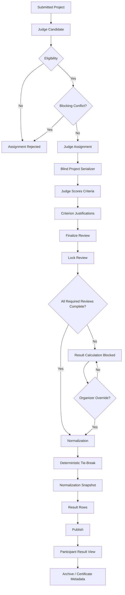

# AGAMOTTO Judging Engine

## 1. Design principle

The judging engine is the core product.

Its purpose is not simply to calculate an average. It enforces a reproducible judging workflow in which assignment eligibility, blindness, conflicts, scoring, review state, completeness, normalization, ranking, publication, and auditability are handled by the server.

> **Build what the system can prove.**

The current implementation does not claim AI judging, AI cheating detection, blockchain, or cryptographic verification.

## 2. Judging lifecycle

```text
Submitted Project
      ↓
Eligibility / Access Check
      ↓
Judge Assignment
      ↓
Conflict Check
      ↓
Blind Project Serialization
      ↓
Structured Review
      ↓
Criterion Scores + Justifications
      ↓
Finalize
      ↓
Lock
      ↓
Completeness Gate
      ↓
Normalization
      ↓
Deterministic Ranking
      ↓
Normalization Snapshot
      ↓
Publication
      ↓
Audit / Integrity Views
      ↓
Identity Reveal according to available event/result views
```

## 3. Rubric rules

Every event must have at least one rubric criterion.

Each criterion has:

- unique `id`
- name
- description
- positive `weight`
- positive `maxScore`
- optional anchors in the frontend schema

The server validates:

```text
criterion IDs are unique
weights > 0
maxScore > 0
sum(weights) = 100
```

Example:

```json
[
  {
    "id": "innovation",
    "name": "Innovation",
    "weight": 60,
    "maxScore": 10
  },
  {
    "id": "technical",
    "name": "Technical",
    "weight": 40,
    "maxScore": 10
  }
]
```

The event stores the rubric configuration. Once judging is underway, changing judging configuration should be treated as a controlled workflow change; the current implementation persists the rubric as event configuration but does not expose a separate “rubric freeze” endpoint.

**Planned:** an explicit configuration lock if the submission requires an independently auditable “rubric locked once judging starts” state.

## 4. Scoring methodology

For each criterion:

```text
criterion contribution =
    (criterion score / max score) × criterion weight
```

Example with:

```text
Innovation: 8/10 × 60 = 48
Technical: 9/10 × 40 = 36
```

The review raw score is:

```text
48 + 36 = 84
```

The API stores the weighted raw total as `total_raw`.

A judge cannot submit:

- an unknown criterion
- a non-numeric score
- a score below 0
- a score above the criterion's max score

When finalizing, every rubric criterion is required.

## 5. Justification requirements

Finalized criterion entries require justification.

The server checks every configured criterion:

```text
finalized criterion
    ↓
score exists
    ↓
criterion justification is non-empty
```

This means the published judging input is not merely a set of numbers; each finalized criterion is expected to contain evidence text from the judge.

The system does not use AI to generate or interpret the justification.

## 6. Assignment strategy

### Manual assignment

The organizer can assign a specific judge to a specific project.

The API checks:

1. project exists
2. judge exists
3. judge has `JUDGE` role
4. organizer owns the event
5. event is in the judging phase
6. assignment does not already exist
7. no blocking conflict exists

A conflict produces HTTP 409 and an audit record.

### Automatic assignment

The current automatic strategy is workload-balanced greedy assignment.

For each project:

1. Find judges not already assigned to that project.
2. Exclude judges with blocking conflicts.
3. Count each candidate judge's current assignment load.
4. Choose the lowest-load judge.
5. Break equal-load choices deterministically by judge ID.
6. Continue until `judges_per_project` is reached or no valid judge remains.

This provides a deterministic and simple balancing strategy.

It does not claim globally optimal matching.

### Required review count

The event stores `judges_per_project`.

The result gate expects that number of assignments and completed reviews for each project.

## 7. Conflict rules

A judge is blocked from a project when:

### Automatic conflict: team membership

The judge is a member of the project team.

### Automatic conflict: event participation

The judge participated in another project/team within the same event.

### Declared conflict

The judge declares a conflict against the project.

### Organizer block

The organizer records a blocking conflict.

Blocking conflicts are stored with:

```text
event
judge
project
reason
blocking = true
timestamp
```

Blocked assignments create:

```text
JUDGE_ASSIGNMENT_BLOCKED
```

in the audit trail.

## 8. Blind judging

Blindness is enforced by the API serializer.

A judge's project response contains judging-relevant project information but omits:

- team name
- participant names
- team member identities
- college
- assignment metadata

The judge also receives only their own review data for the project.

This is enforced at the API/data layer, not merely through CSS or hidden frontend fields.

## 9. Judge identity privacy

The participant-facing project/result serializers do not expose judge assignment/review identity.

Organizers can see assignment and review identities.

The current application supports event/result lifecycle and participant result views, but it does not provide a separate cryptographic identity-reveal mechanism.

**Planned:** an explicit identity-reveal configuration workflow if the final product requires a distinct pre/post-publication identity phase.

## 10. Review lifecycle

```text
DRAFT
  │
  └── finalize ──→ FINALIZED
                         │
                         └── lock ──→ LOCKED
```

Rules:

- DRAFT is editable.
- FINALIZED requires complete criterion scores.
- FINALIZED requires criterion justifications.
- FINALIZED may move to LOCKED.
- DRAFT cannot jump directly to LOCKED.
- LOCKED cannot be modified through the normal review endpoint.
- Organizer reopening changes the state to DRAFT.
- Reopening requires an explicit reason and creates an audit event.

This state machine is enforced by the backend.

## 11. Score visibility

During judging:

- judges see only their own review for a project
- judges do not receive other judges' active scores
- participants do not receive judge identities or active judge reviews

Organizers can inspect the complete judging state for their event.

## 12. Incomplete judging

Before result calculation, the server checks every project for:

- missing assignments
- missing completed reviews
- insufficient completed review count

A project is considered incomplete if:

```text
assignments < judges_per_project
OR
completed reviews < judges_per_project
OR
an assigned judge has no completed review
```

If any project is incomplete:

```text
RESULTS_CALCULATED is blocked
```

unless the organizer supplies an explicit override.

The override requires:

```text
override = true
reason = non-empty
```

The reason is recorded in the result-calculation audit event.

This makes an exceptional result calculation an explicit, reviewable organizer decision.

## 13. Normalization

The event chooses one of the implemented methods:

```text
z_score
trimmed_mean
borda
```

### Primary method: judge-level Z-score

For every judge:

```text
μj = mean of that judge's completed raw scores
σj = population standard deviation of that judge's completed raw scores
```

For a review:

```text
zij = (scoreij - μj) / σj
```

The project's normalized score is the mean of the available judge z-scores.

If:

```text
σj = 0
```

the implementation uses:

```text
zij = 0
```

This is deterministic and avoids undefined division.

### Numeric example

Suppose two judges score three projects.

Judge A:

```text
Project A = 84
Project B = 74
Project C = 94
```

Mean:

```text
(84 + 74 + 94) / 3 = 84
```

Population standard deviation:

```text
sqrt(((0²) + (-10²) + (10²)) / 3)
≈ 8.165
```

Judge A z-score for Project C:

```text
(94 - 84) / 8.165
≈ +1.225
```

Suppose Judge B has:

```text
Project A = 70
Project B = 60
Project C = 80
```

Mean:

```text
70
```

Population standard deviation:

```text
≈ 8.165
```

Judge B z-score for Project C:

```text
(80 - 70) / 8.165
≈ +1.225
```

Project C's normalized score becomes:

```text
(1.225 + 1.225) / 2
≈ +1.225
```

The important property is that each judge is centered around their own scoring distribution before the project-level values are averaged.

### Trimmed mean

For a project with at least three judge scores:

```text
sort scores
remove one lowest
remove one highest
average remaining values
```

With fewer than three values, the implementation averages the available values without trimming.

### Borda

Each judge ranks the projects they scored.

For `n` available projects, position `p` receives:

```text
(n - p) / n × 100
```

The implementation averages the resulting contributions for the project across its completed reviews.

## 14. Normalization data stored

A `normalization_snapshots` row records:

- snapshot ID
- event ID
- method
- creation time
- judge-level statistics
- result rows
- method-specific metadata

For Z-score this includes:

```text
judge mean
judge standard deviation
judge review count
fallback metadata
```

The result rows store:

```text
project ID
raw score
normalized score
final score
rank
```

The normalization proof endpoint exposes the stored snapshot information and formula.

## 15. Reproducible calculation

The reproducibility chain is:

```text
event rubric
     +
completed reviews
     +
configured normalization method
     +
stored judge statistics
     +
configured tie-break order
     ↓
normalization snapshot
     ↓
result rows
```

The calculation can therefore be inspected after the fact without depending on an external service.

For Z-score, the API exposes the formula:

```text
z=(judge_score-judge_mean)/judge_std
```

and records the zero-variance/singleton fallback metadata.

## 16. Ranking and tie-breaking

The ranking input is:

```text
normalized score
```

with configured secondary ordering.

Allowed tie-break fields:

```text
normalized_score
raw_score
code_name
```

Default:

```text
1. normalized_score
2. raw_score
3. code_name
```

Numeric scores are ordered descending. `code_name` provides a deterministic final ordering.

The event stores the tie-break order, so ranking is not dependent on database row order.

## 17. JudgeLens

JudgeLens is a deterministic evidence view for organizers.

The currently implemented endpoint exposes:

- total review count
- completed review count
- per-judge mean raw score
- per-judge standard deviation
- per-judge review count
- review update timing

It does not generate narrative conclusions.

The current API response has an empty criterion-level aggregation collection.

**Planned:** criterion-level aggregation if needed.

The frontend should not describe JudgeLens as an AI analysis system.

## 18. Integrity Pulse

Integrity Pulse is a deterministic operational check.

Current checks include:

- incomplete projects
- blocked assignment count
- blocking conflict count

The system does not convert these signals into accusations.

For example:

```text
blocking conflicts = 2
```

means there are two blocking conflict records; it does not mean a judge cheated.

**Planned:** additional deterministic checks for any new integrity requirements, provided they can be implemented from actual evidence.

## 19. Audit events

Judging-related audit events include:

```text
JUDGE_ASSIGNED
JUDGE_ASSIGNMENT_BLOCKED
CONFLICT_DECLARED
REVIEW_CREATED
REVIEW_FINALIZED
REVIEW_LOCKED
REVIEW_REOPENED_BY_ORGANIZER
RESULTS_CALCULATED
RESULTS_PUBLISHED
```

Audit records contain:

```text
actor
event
action
entity type
entity ID
timestamp
details
```

No blockchain or cryptographic hash-chain claim is made.

## 20. Full judging flow



## 21. API-first enforcement

The judging engine exposes server-side operations for:

```text
POST /api/assignments
DELETE /api/assignments/{project_id}/{judge_id}

POST /api/conflicts
POST /api/events/{event_id}/conflicts
POST /api/events/{event_id}/auto-assign

POST /api/reviews
POST /api/reviews/reopen

POST /api/events/{event_id}/results/calculate
POST /api/events/{event_id}/results/publish

GET /api/events/{event_id}/integrity
GET /api/events/{event_id}/judgelens
GET /api/events/{event_id}/normalization-proof/{snapshot_id}
GET /api/events/{event_id}/audit
```

The frontend calls these real API operations rather than replacing them with fake success states.

## 22. Threat model

| Threat | Mitigation |
|---|---|
| Judge sees participant identity | Blind API serializer |
| Judge sees unassigned project | Project access requires assignment |
| Judge evaluates conflicted project | Conflict check on assignment and review |
| Judge changes locked review | Backend rejects locked mutation |
| Incomplete reviews reach publication | Result gate |
| Exceptional incomplete result is unexplained | Override requires reason and audit |
| Participant sees judge identity | Participant serialization omits it |
| Ranking changes due to unstable ties | Persisted deterministic tie-break order |
| Integrity signal becomes an accusation | Integrity Pulse returns factual counts/states only |

## 23. Pairwise judging

**Not implemented.**

The current judging engine uses criterion scoring plus configured normalization and ranking.

Any pairwise comparison mode should remain **Planned** unless implemented end-to-end.

## 24. Acceptance checklist

The following should be demonstrated by automated tests and/or the final demo:

- [x] unassigned judge cannot access project
- [x] conflicted assignment is blocked
- [x] duplicate assignment is blocked
- [x] score range is validated
- [x] missing finalized criterion is blocked
- [x] missing finalized justification is blocked
- [x] draft can be finalized
- [x] finalized review can be locked
- [x] locked review cannot be edited
- [x] organizer can reopen with a reason
- [x] reopen is audited
- [x] incomplete judging blocks calculation
- [x] override requires a reason
- [x] normalization snapshot is created
- [x] normalization proof is available
- [x] tie-break is deterministic
- [x] published results reference a snapshot
- [x] participant can view published result for their team
- [x] blind response omits participant identity
- [x] judges do not receive other judges' active reviews

## 25. What is deliberately not claimed

AGAMOTTO does not claim:

- AI judging
- AI cheating detection
- blockchain
- cryptographic verification
- cryptographic hash-chain audit logs
- automated accusations of bias or cheating

The product claim is narrower and testable:

> A self-hostable judging engine that enforces blind assignment, conflict checks, structured scoring, deterministic normalization/ranking, stable result snapshots, and an application audit trail.

## 26. Planned judging work

- Explicit rubric/configuration freeze once judging starts
- Explicit identity-reveal configuration workflow
- Criterion-level JudgeLens aggregation
- Any additional deterministic integrity checks required by future event policy
- Cryptographic verification, only if actually implemented and tested
- Pairwise judging, only if implemented end-to-end
